# PWABuilder HMS/AppGallery Support

## Design Specification
**Keywords**: pwabuilder, appgallery, huawei, hms, ag

**Abstract**: This document describes the system design specifications and major requirements of PWABuilder-AG.com with HMS/AG support

**List of Abbreviations**:

| Abbreviation      | Full Spelling |
| ----------- | ----------- |
| AG      | Huawei AppGallery       |
| HMS   | Huawei Mobile Services        |
| GMS      | Google Mobile Services       |
| HW   | Huawei        |
| CP | Content Partner (Huawei Developer) |


## Overview
PWABuilder.com is a web site to allow users to convert their web sites to Android or others package and publish it to many app stores like Google Play Store, Microsoft App Store, Samsung Galaxy Store etc.

PWABuilder.com also allows users to plug many components or modules into their Android package like Google/Microsoft/Facebook account login, People Graph etc.

The purposes of this project are:
1)  Allow PWABuilder.com users to convert their website to native Android APK, plug HMS kits like Push Kit, Analytics Kit, Ads Kit as the components in their app package.
2)  Upload and publish PWABuilder.com generated Android package to Huawei App Gallery directly.

## System Components
The system consists of the following parts, each part will be explained in detail later in the document.
* **UI**
  * PWA APK configuration UI
  * APK Package generation/download and publish UI
* **HMS kit integration**
  * Push Kit
  * Analytics Kit
  * Ads Kit
* **Backend pipeline**
  * Integration with UI (services)
  * Based on configuration, extract HMS kit code and merge with package code generated by CLI
  * Using CLI to build final APK package
  * Push the final APK package to AG based on AGC configuration

## System Diagram
The following is the high-level system design for PWABuilder-AG.com.
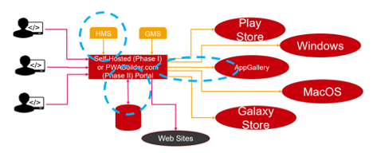

## Workflow

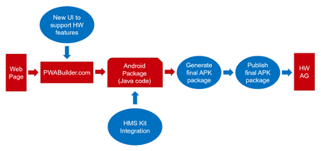

## System Architecture

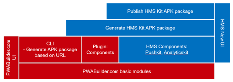


## UI Workflow
* CP visits PWABuilder.com or our clone site – PWABuilder-ag.com, types the domain and clicks “Start”
 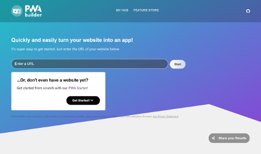

* CP clicks on “Build My PWA”

 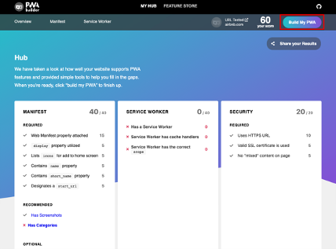

* CP will find the page with all possible app stores supported by PWABuilder. Currently PWABuilder supports Google, Microsoft and Samsung. Huawei will be the another app store supported by PWABuilder.com

 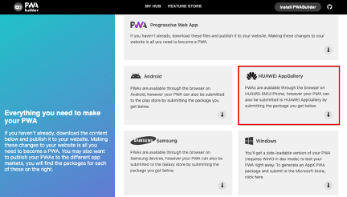


* Here is the detail Huawei app store UI design

 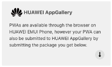

 * Step 1: Customize AppGallery Android APK options. The Key and Key store passwords are required. Both passwords must be the same, and at least 6 characters long. User can use Get Icon function to get 10 icon URLs. This feature is driven by Google Custom Search Engine.
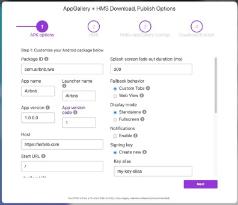

 
 * Step 2: Select which HMS kit (Push, Analytics, Ads) to include in APK.

 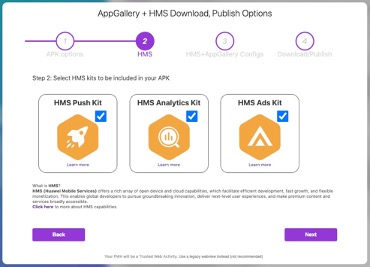
 
 * Step 3: Enter HMS Kit (Ads) configuration and upload agconnect-services.json. HMS Kit configuration will only be shown if HMS Ads Kit is selected.

 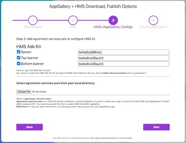

 * Step 4:
   * Option 1: Download APK - Developer can build and download the APK zip file.
 
   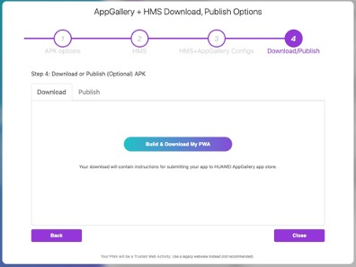
 
   When CP clicks “Build & Download My PWA” button, the follow flows will be started:
1.  Verify all configurations.
2.  Extract HMS kits configurations
3.  Extract APK Build configurations
4.  Extract Web URL, iconURL
5.  Call CLI at https://api.pwabuilder-ag.com/build_apk to generate APK package based on Web URL and put the package files in local directory (on server)
6.  Download HMS kits templates to local directory (on server) if there is a new version (to be supported in future version).
7.  Download HMS SDKs to local directory (on server) if there is a new version (to be supported in future version).
8.  Use Gradle to compile and generate the package for the app
9.  Download APK package to local browser Download Path

   * Option 2: Publish APK (Optional) Developer can use this option to publish their HMS APK to HUAWEI AppGallery Appstore directly. The following information is required:

   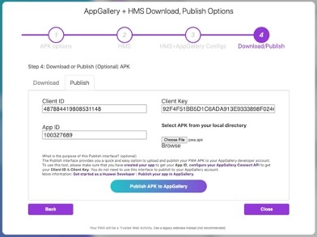

* APK package from local path
* Client ID
* Client Key
* App ID
Click “Publish APK to AppGallery” button to initiate the app submission.

* When CP clicks “Publish the APK” button, the follow flows will be started:
* Verify all configuration.
* Call https://api.pwabuilder-ag.com/publish_apk to publish APK package with Publish configuration


## Data Structure
* **Agconnect-services.json**

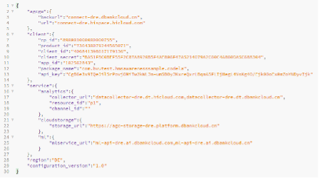

## REST API
* **Build APK API format**
  * https://api.pwabuilder-ag.com/build_apk
  * Protocol: POST
  * Purpose: Process JSON and execute CLI to build APK.
  * Request Body:
```
{
        "website":"https://www.ebay.com",
        "HMSKits": ["push", "ads"],
        "ads_id": "1234",
        "agcs": "Base64File"
}
```


* **Publish APK API format**
  * https://api.pwabuilder-ag.com/publish_apk
  * Protocol: POST
  * Purpose: Receive APK Base64 file and POST to AppGallery Connect API.
  * Request Body:
```
{
        "client_id": "id",
        "client_key": "key",
        "app_id": "1234",
        "apk": "Base64File"
}
```
  * AGC API format
    * https://developer.huawei.com/consumer/en/doc/development/AppGallery-connect-References/agcapi-upload-url_v2
    * https://developer.huawei.com/consumer/en/doc/development/AppGallery-connect-References/agcapi-upload-file_v2
    * https://developer.huawei.com/consumer/en/doc/development/AppGallery-connect-References/agcapi-app-submit_v2


* **Generate web manifest API format**
  * https://api.pwabuilder-ag.com/webmanifest
  * Protocol: POST
  * Purpose: Generate a backup web manifest.
  * Request Body:
```
{
        "url": "urlString"
}
```


* **Generate icon URLs API format**
  * https://api.pwabuilder-ag.com/get_icons
  * Protocol: POST
  * Purpose: Call Google Custom Search Engine API using keyword and return an array of image icon URLs. This feature is driven by Google Custom Search engine. To enable this feature, please create a custom search engine here - https://cse.google.com/cse/setup/basic. Make sure that 'Search the entire web', 'Image Search' are turned ON. 
  > This service is subject to API call charge. 
  >
  > Please setup both following variables in API .env file.
  >
  > cx = Google CSE ID, key = Google API Key
  * Request Body:
```
{
        "name": "string"
}
```

## Build Script CLI
### Getting Build Options
The build script uses the NPM library Commander to receive build inputs. Beyond preventing a null error from occurring, the script does not check if any of the input values are properly formatted and is completely dependent on the front-end to do these checks.
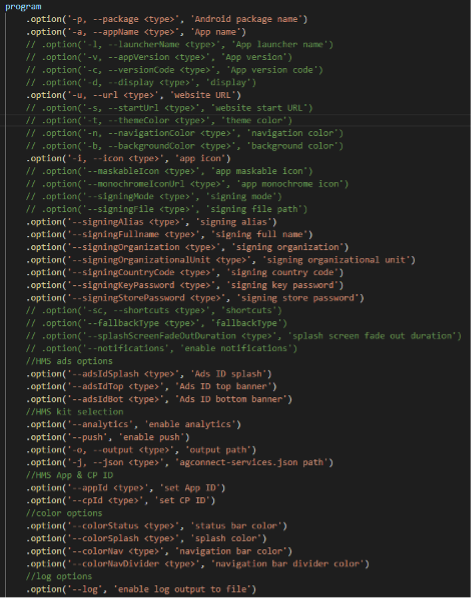


1.  Package Name (Required) :: Must match the value on app project and AGCS JSON file.
2.  App Name (Required) :: Changes the name displayed underneath the app icon on the home screen
3.  URL (Required) :: Specifies the PWA URL
4.  Icon (Required) :: Sets the app icon displayed on the home screen
5.  Signing Alias (Required) :: To generate Keystore and sign app 
6.  Signing Fullname (Required) :: To generate Keystore and sign app
7.  Signing Organization (Required) :: To generate Keystore and sign app
8.  Signing Organizational Unit (Required) :: To generate Keystore and sign app
9.  Signing Country Code (Required) :: To generate Keystore and sign app
10. Signing Key Password (Required) :: To generate Keystore and sign app. Minimum length of 6 characters.
11. Signing Store Password (Required) :: To generate Keystore and sign app. Minimum length of 6 characters.
12. Ads Splash ID (HMS/Optional) :: Enables Splash ad and sets Splash ad ID
13. Ads Top Banner ID (HMS/Optional) :: Enables Banner ad at top position and sets Banner ad ID
14. Ads Bottom Banner ID (HMS/Optional) :: Enables Banner ad at bottom position and sets Banner ad ID
15. Analytics (HMS/Optional) :: Enables Analytics Kit from client. Analytics must also be enabled from AGC. 
16. Push (HMS/Optional) :: Enables Push Kit from client. Push must also be enabled from AGC.
17. Output Path (Required) :: Sets output path of generated files
18. AGCS JSON Path (Required) :: Specifies AGCS JSON file path
19. App ID (Optional) :: Required for Analytics and Push. Same value as AGC.
20. CP ID (Optional) :: Required for Analytics and Push. Same value as AGC.
21. Status Bar Color (Optional) :: Sets color of the top status bar.
22. Splash Screen Color (Optional) :: Sets color of the loading splash screen.
23. Navigation Bar Color (Optional) :: Sets color of the bottom navigation bar
24. Navigation Bar Divider Color (Optional) :: Sets color of line at the top of navigation bar.
25. Log Output (Optional) :: Enables log output to text file at output path.


### Git Operations
Git init is called in case template path has not been initialized. Then git pull is called to check for updates from the template repo on GitHub. This check is done every time that the Build Script is called.
https://github.com/bryantvu/HMS-PWA-Core-Template

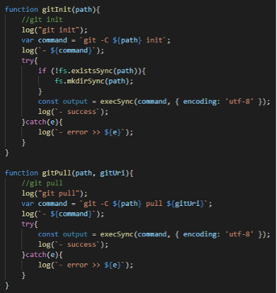

### PWA Builder CLI
The PWA Builder CLI is given the URL and a temp path as the only 2 variable inputs. Although the documentation shows that –image can be used to add an app icon from a local path, testing shows that it does nothing at all. Setting the app icon is done manually in the File Modification step.

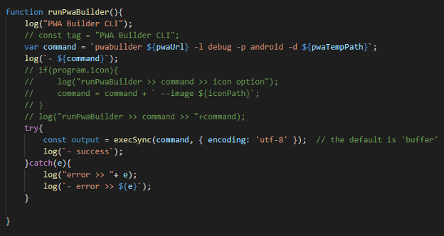


### Files/Values Copied from PWA Builder to Build Path
1.  PWA manifest.json (file)
2.  Strings.xml (value)
    * App name
3.  Colors.xml (value)
    * Status bar color
    * Splash screen color
    * Navigation bar color
    * Navigation bar divider color

### Additional Files added to Build Path
1.  AGCS JSON 
2.  Local.properties
3.  App icon mipmap-hdpi 
4.  App icon mipmap-mdpi 
5.  App icon mipmap-xhdpi 
6.  App icon mipmap-xxhdpi 
7.  App icon mipmap-xxxhdpi 

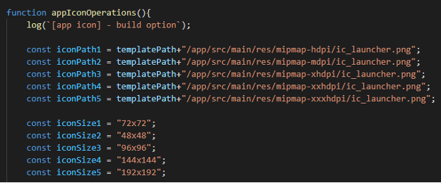

### Files Modified in Build Path
1.  App icon folders :: images with numeric filenames generated by PWA Builder CLI cause gradle build errors and must be deleted.
2.  App icon :: Specified app icon image is taken and resized to fit specification for each icon folder
3.  Build.gradle :: modify package name
4.  AndroidManifest.xml :: modify package name, App ID, CP ID
5.  Java Files :: modify package name
    * MainActivity.java :: enable Ads based on build options
6.  Strings.xml :: modify Ad IDs
7.  Java file path :: refactor folders to match package name

### Steps to Generate Final Signed APK 

1.  **Create release version of APK.**
gradle app:zipApksForRelease
2.  **Generate a private key.** Keystore generation is automated without user interaction.
```
keytool -genkey -noprompt -v  -keystore hms-key.jks -keyalg RSA -keysize 2048  -validity 10000 -alias HMSTest -dname "CN=fname lname, OU=orgunit, O=org, L=city S=State,C=ccode" -storepass asdf1234  -keypass asdf1234
```

```
Attributes details
keystore – keystore file name
alias – alias name
CN – firstname lastname
OU – organizational unit
O – organization
L – city or locality
S – state
C – country code
storepass – store password
keypass – key password
```

3.  Align unsigned APK. (Optional)
Zipalign is an archive alignment tool to optimize APK file. The purpose is to ensure that all uncompressed data starts with a particular alignment relative to the start of the file. Specifically, it causes all uncompressed data within the APK, such as images or raw files, to be aligned on 4-byte boundaries. The benefit is a reduction in the amount of RAM consumed when running the application. 
```
zipalign -v -p 4  source fname(from#1)   aligned_fname(new destination aligned fname)
```

4.  Sign APK with generated private key.
```
apksigner sign --ks keystore_filename  --out destination_file.apk aligned_fname.apk(from #3)
```

5.  Verify APK is signed. (Optional Step, Not included in Build Script)
Check whether the APK's signatures are expected to be confirmed as valid on all Android platforms that the APK supports.
```
apksigner verify destination_file.apk
```

### Files Copied to Output Path
1.  Pwa.apk :: APK generated by Build Script
2.  Readme.html :: Same README file included when PWA is generated from pwabuilder.com
3.  Pwabuilder_keystore.jks :: Keystore file generated by Build Script
4.  Signing-key-info.txt :: Values used to generate Keystore file. Includes password.

### Log Output
Log initialization is always called. It initializes the date and time in a readable format to add in the log and in MS as a unique path name. All text passed to the log function is printed to console and added to a log text array.

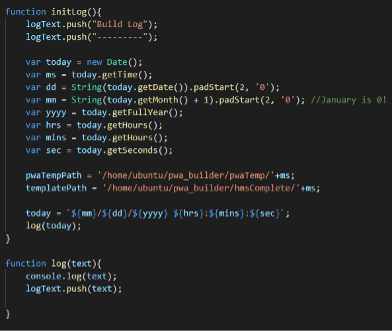

If the log build option is set, the log is output to a text file in the Build and Output paths.

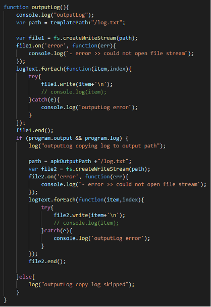


If you have question, please email us - [developer_dtse@futurewei.com](mailto:developer_dtse@futurewei.com). Thank you.
